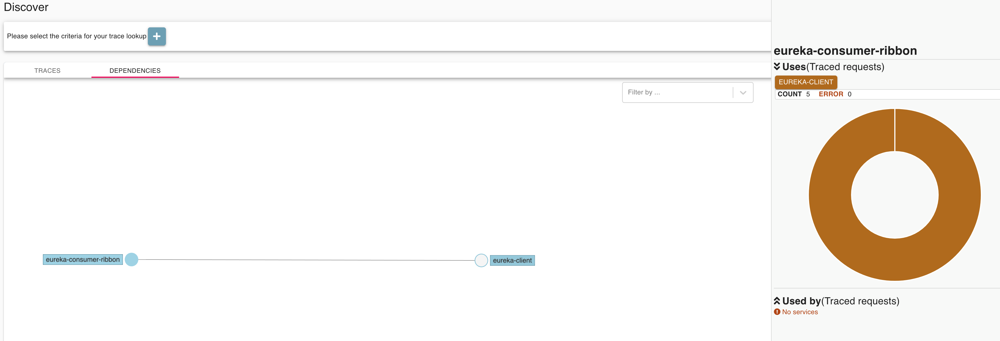

# Zipkin

Application’s need to be “instrumented” to report trace data to Zipkin. This
usually means configuration of a [tracer or instrumentation library](https://zipkin.io/pages/tracers_instrumentation.html). The most
popular ways to report data to Zipkin are via http or Kafka, though many other
options exist, such as Apache ActiveMQ, gRPC and RabbitMQ. The data served to
the UI is stored in-memory, or persistently with a supported backend such as
Apache Cassandra or Elasticsearch.

## Quick Start via docker-compose

Start all service via docker-compose:

* mysql
* zipkin
* zipkin-dependencies

```shell script
cd spring-cloud/zipkin
docker-compose up -d
```

## Zipkin and UI

### Executable jar

The quickest way to get started is to fetch the [latest released server](https://search.maven.org/remote_content?g=io.zipkin&a=zipkin-server&v=LATEST&c=exec) as a self-contained executable jar. Note that the Zipkin server requires minimum JRE 8. For example:

```shell script
curl -sSL https://zipkin.io/quickstart.sh | bash -s
java -jar zipkin.jar
```

### Docker

```shell script
docker run --name zipkin-ui -p 9411:9411 -e STORAGE_TYPE=mysql -e MYSQL_HOST=mysql -e MYSQL_TCP_PORT=3306 -d openzipkin/zipkin:2.16.2
```

Once the server is running, you can view traces with the Zipkin UI at `http://localhost:9411/zipkin/`.

To see more detail on [docker hub of openzipkin](https://hub.docker.com/r/openzipkin/zipkin).

## Mysql

Start mysql via docker:

```shell script
# mysql version 8.0
docker run --name mysql -p 3306:3306 -e MYSQL_ROOT_PASSWORD=123456 -d mysql:8.0
```

Copy schema file to container of mysql:

```shell script
cd spring-cloud
docker cp zipkin/storage/mysql-v1/mysql.sql mysql:/mysql.sql
```

Attach execute mysql shell command:

```shell script
docker exec -it mysql bash
```

Install the schema and indexes:

```shell script
mysql -u root -e "create database if not exists zipkin" -p
mysql -u root -Dzipkin < /mysql.sql -p
```

Accessing MySQL using the command line interface, and check databases:

```shell script
docker exec -it mysql mysql -u root -p
$ mysql> show databases;
```

## Zipkin-dependencies

Zipkin Dependencies collects spans from storage, analyzes links between services, and stores them for later presentation in the [web UI](https://github.com/openzipkin/zipkin/tree/master/zipkin-lens) (ex. http://localhost:8080/dependency).

This process is implemented as an Apache Spark job. This job parses all traces in the current day in UTC time. This means you should schedule it to run just prior to midnight UTC.

The quickest way to get started is to fetch the [latest released job](https://search.maven.org/remote_content?g=io.zipkin.dependencies&a=zipkin-dependencies&v=LATEST) as a self-contained jar.
Note that Zipkin Dependencies requires minimum JRE 1.8. For example:

### Executable jar

```shell script
curl -sSL https://zipkin.io/quickstart.sh | bash -s io.zipkin.dependencies:zipkin-dependencies:LATEST zipkin-dependencies.jar
STORAGE_TYPE=cassandra3 java -jar zipkin-dependencies.jar
```

### Docker 

You can also start Zipkin Dependencies via [Docker](https://github.com/openzipkin/docker-zipkin-dependencies).
```shell script
docker run --name zipdep --link mysql -e STORAGE_TYPE=mysql -e MYSQL_DB=zipkin -e MYSQL_USER=root -e MYSQL_PASS=123456 -e MYSQL_HOST=mysql -e MYSQL_TCP_PORT=3306 openzipkin/zipkin-dependencies:2.3.2 
```

# Demo

Start the service/application as below:

* zipkin server
* eureka-consumer-ribbon
* eureka-consumer

And input the url on browser:
```bash
http://localhost:2201/trace-1
```
 
Then it would show the result as below via browse the url `http://localhost:9411/zipkin/`


 




### REF

* [openzipkin/zipkin](https://github.com/openzipkin/zipkin/blob/master/README.md) on Github
* [openzipkin/zipkin-dependencies](https://github.com/openzipkin/zipkin-dependencies/blob/master/README.md) on Github
* [openzipkin/docker-zipkin](https://github.com/openzipkin/docker-zipkin)